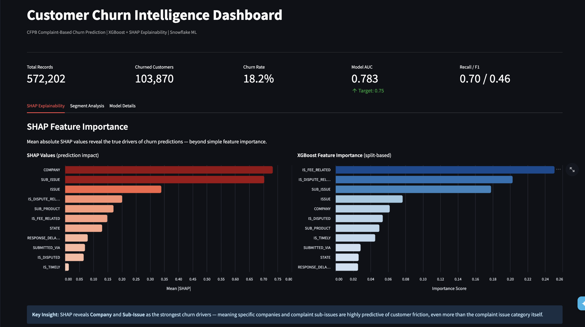
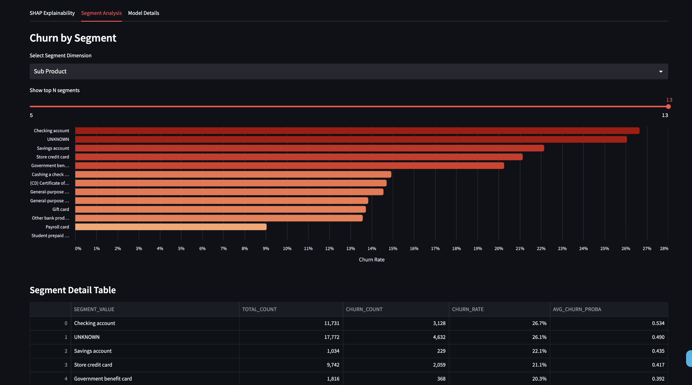
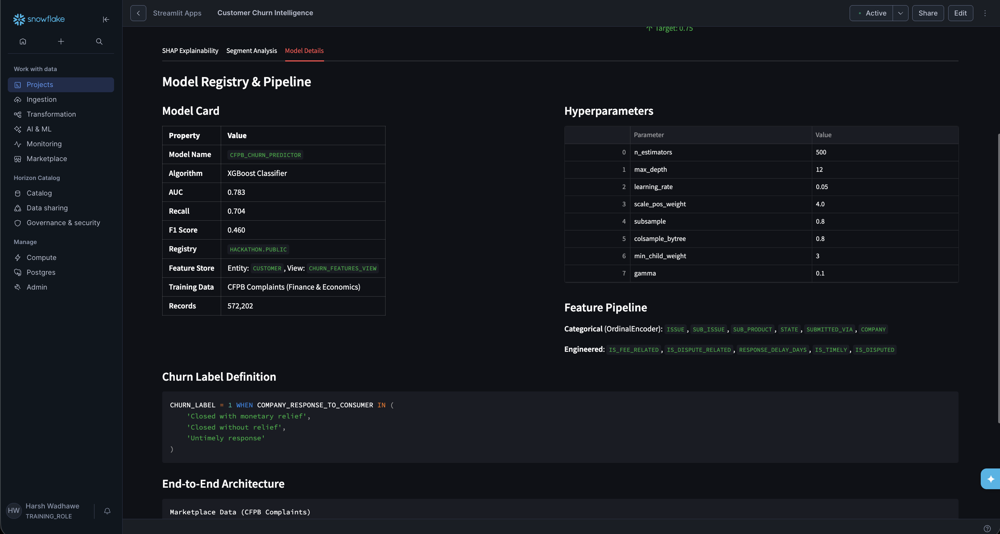

# Demo Script — Customer Churn Intelligence

TAMU CSEGSA x Snowflake Hackathon 2026 | Track A — ML Classification

---

## Opening (30 seconds)

"Every financial institution loses customers silently. A complaint gets filed, a resolution feels inadequate, and the customer never comes back. We wanted to answer a specific question: **can we predict which customers are about to churn — before they leave — using only the complaints they've already filed?**

We built the entire pipeline inside Snowflake. No external APIs, no external compute. Marketplace data in, predictions out."

---

## Part 1 — The Snowflake Notebook (90 seconds)

### What the notebook does

"The notebook is the training pipeline. Walk through it top to bottom and it builds everything the dashboard needs."

**Cell 1 — Setup**
- Connects to the active Snowflake session
- Targets `HACKATHON.PUBLIC` and creates a temp stage for Snowpark

**Cell 2 — Data Extraction & Labeling**
- Pulls directly from the Snowflake Marketplace: `SNOWFLAKE_PUBLIC_DATA_FREE.PUBLIC_DATA_FREE.FINANCIAL_CFPB_COMPLAINT`
- Filters to credit card and bank account products only
- Defines churn as complaints resolved with `'Closed with monetary relief'`, `'Closed without relief'`, or `'Untimely response'` — responses that signal the customer's problem wasn't solved
- Engineers five behavioral features: `IS_FEE_RELATED`, `IS_DISPUTE_RELATED`, `RESPONSE_DELAY_DAYS`, `IS_TIMELY`, `IS_DISPUTED`
- Materializes the result as `CHURN_GOLD` with change tracking enabled

**Cell 3 — Feature Store**
- Registers a `CUSTOMER` entity keyed on `ROW_ID`
- Creates `CHURN_FEATURES_VIEW` as a registered Feature View — keeping features versioned and reusable
- Generates a timestamped training dataset using `fs.generate_dataset()`, then does an 80/20 split

**Cell 4 — Model Training & Registry**
- Builds a Snowflake ML Pipeline: `OrdinalEncoder` for six categorical columns, then `XGBClassifier` with tuned hyperparameters (`scale_pos_weight=4.0` to handle class imbalance)
- Evaluates on the held-out test set: **AUC 0.783, Recall 0.704, F1 0.460**
- Logs the trained pipeline to the Snowflake Model Registry as `CFPB_CHURN_PREDICTOR`
- Saves XGBoost feature importances to `MODEL_DRIVERS`

**Cell 5 — SHAP Explainability**
- Extracts the native XGBoost model from the pipeline and runs `shap.TreeExplainer` on a 2,000-row sample
- Saves mean absolute SHAP values to `SHAP_FEATURE_IMPORTANCE`
- Key finding: **Company** and **Sub-Issue** are the strongest churn drivers — meaning *who* the complaint is about and *what specifically went wrong* matter more than the broad issue category

**Cell 6 — Segment Scoring**
- Attaches predicted churn probabilities back to test records
- Aggregates churn rate and average predicted probability by `STATE`, `SUB_PRODUCT`, and `SUBMITTED_VIA`
- Saves to `CHURN_SEGMENT_SCORES` — the dashboard reads directly from this

---

## Part 2 — The Streamlit Dashboard (90 seconds)

"Once the notebook runs, everything the dashboard needs is in Snowflake tables. The app reads live — no data is baked in."

### KPI Bar (top of page)

"Five metrics at a glance: total records, how many churned, the churn rate, model AUC, and Recall/F1. These give the reviewer an instant read on both the data and model quality."

### Tab 1 — SHAP Explainability

"This is the most important tab. Two charts side by side:

- Left: **SHAP values** — how much each feature actually moved predictions. This is the honest number.
- Right: **XGBoost feature importance** — the split-based score the model reports internally.

The comparison matters. Both agree that `Company` and `Sub_Issue` dominate. That's the insight: it's not *what kind* of complaint (the Issue) — it's *who* the complaint is about and *what specifically* went wrong. Certain companies and certain sub-issues are near-perfect predictors of a customer not coming back."

### Tab 2 — Segment Analysis

"A filterable bar chart. Pick a dimension — Sub-Product, State, or Submission Channel — and see churn rate for every segment in that dimension. The slider trims to the top N.

The table below it shows raw counts alongside the model's average predicted probability, so you can distinguish high-churn-rate segments that are also low-volume from the ones that actually represent scale."

### Tab 3 — Model Details

"The model card: algorithm, metrics, registry location, feature store reference, training data source, record count. All the reproducibility information a reviewer needs to understand what was built and where it lives.

Below that: the hyperparameter table, the feature pipeline description, the churn label SQL definition, and an end-to-end architecture diagram in plain text."

---

## Closing (30 seconds)

"The full pipeline — data extraction, feature engineering, Feature Store registration, model training, SHAP explainability, segment scoring, model registry — runs entirely inside Snowflake. The dashboard consumes live table results with no intermediate exports.

The model hits AUC 0.783 with recall at 0.704, meaning it catches roughly 70% of customers who will churn. In a real deployment, that's the number that matters — catching churners before they leave is the whole point.

Everything is reproducible: re-run the notebook, get a new versioned model in the registry and fresh support tables. The dashboard updates automatically."

---

## Q&A Prep

**Why XGBoost and not Snowflake's native Forecasting API?**
This is a classification problem (will this customer churn: yes/no), not a time-series forecast. XGBoost via Snowflake ML is the right tool. The complaint timestamp is used only to compute `RESPONSE_DELAY_DAYS`.

**Why is F1 lower (0.46) relative to AUC (0.78)?**
The dataset is class-imbalanced — most complaints don't result in churn. `scale_pos_weight=4.0` boosts recall at the cost of precision, which pulls F1 down. For a churn use case, catching true churners (recall) matters more than minimizing false positives.

**What's the SHAP monkey-patch about?**
Snowflake's bundled SHAP version has a known incompatibility with how the Snowflake ML XGBoost wrapper serializes the model. The patch corrects the JSON parsing logic so `TreeExplainer` can read the model. It's a one-time fix with no effect on SHAP values.

**Could this be productionized?**
Yes. The Feature Store and Model Registry setup is already production-ready. Add a Snowflake Task to retrain on a schedule, update the model version in the registry, and the dashboard reflects new results automatically.
